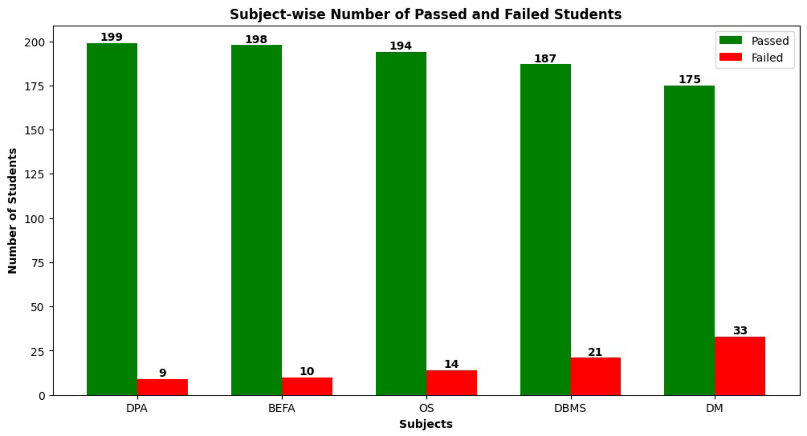
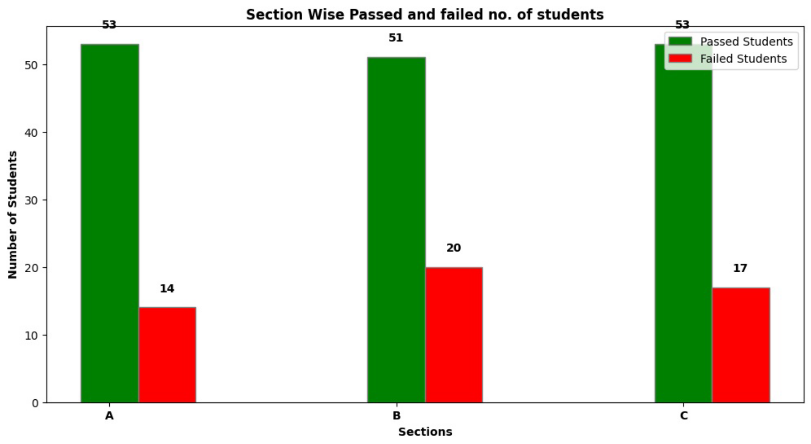
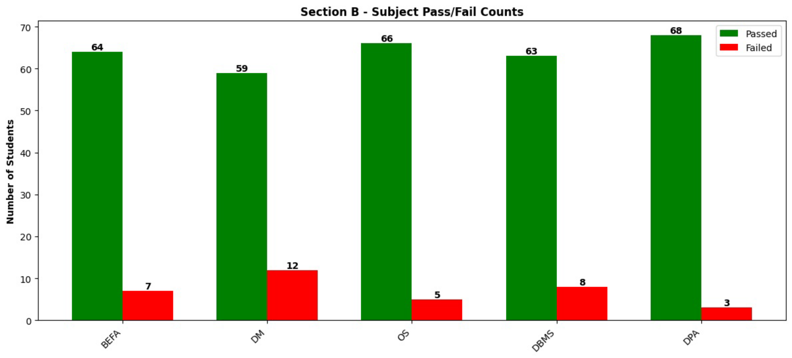
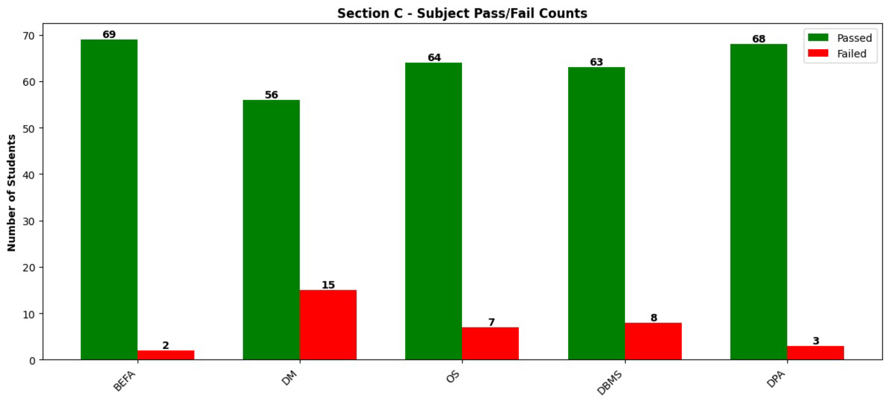
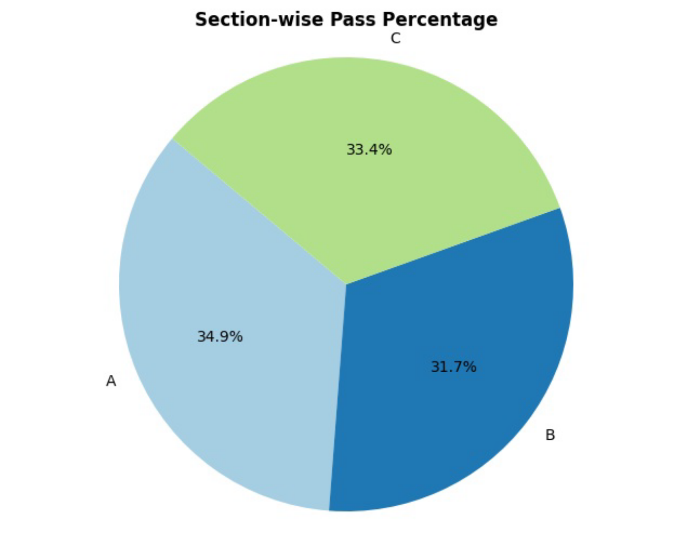
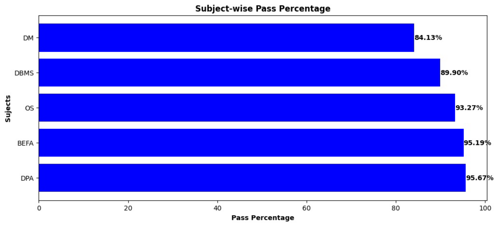
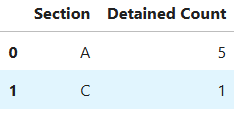

**Department of Data Science Results Analysis Report**

**Introduction**

This report presents an analysis of student performance data to evaluate
trends across different subjects and sections. Key insights include
pass/fail distributions, average scores by subject, and overall
section-wise performance.

**Abstract**

This project is a **Department of Data Science Results Analysis** that
processes student performance data to generate insights on pass/fail
counts by section and subject. The project includes visualizations that
display results breakdown across different sections, helping in
analyzing academic performance trends and identifying areas of
improvement.

**Features**

- **Section-wise Pass/Fail Analysis**: Visualizes the number of
  students who passed or failed in each subject, separated by section.

- **Subject-wise Performance Comparison**: Compares performance
  metrics across subjects to give a clear view of student strengths
  and weaknesses.

- **Data Cleaning & Transformation**: Prepares raw data by handling
  missing values and converting data types as needed.

- **Interactive Data Visualization**: Generates visual charts (bar
  plots) to illustrate performance statistics.

**Dataset**

The dataset includes columns such as:

- Roll Number, Name, Section

- Subject names (e.g., BEFA, DM, OS, DBMS, DPA) with corresponding
  status columns (Befa_Status, Dm_Status, etc.)

- Total_Marks, SGPA, CGPA, Subjects_due

**Abbreviations:**

BEFA - Business Economics and Financial Analysis

DM - Discrete Mathematics

OS - Operating Systems

DBMS - Database Management Systems

DPA - Data Preparation and Analysis

ES - Environmental Science

SD-Lab - Skill Development Lab

**Project Structure**

- **data.csv**: Contains the student performance data used in this
  analysis.

- **DataScience-Results-Analysis.ipynb**: Jupyter Notebook with data
  processing, analysis, and visualization code.

- **app.py**: Contains the Selenium code for Data Scraping

**Insights and Findings**

**1. Subject-Wise Average Marks**

**Insight:** Subjects such as \`OS-Lab\`, \`DBMS-Lab\`, and \`SD-Lab\`
have higher average marks

compared to theory subjects like \`DM\` and \`DBMS\`.

**2. Subject-Wise Pass/Fail Counts**

**Insight:** Higher pass percentages were observed in subjects like
\`DPA\` and \`BEFA\`, while \`DM\` had a lower pass percentage.

**3. Section-Wise Pass/Fail Counts**

**Insight:** Sections like 'A' and 'C' has high and equal no. of
students passed and the 'B' section has the high inn no. of students
failed

**4. Subject-Wise Pass/Fail Counts - Section-Wise**

**Insight:** Higher pass percentages were observed in subjects like
\`DPA\` and \`BEFA\`, while \`DM\` had a lower pass percentage in each
Section.

**5. Top 10 Students by CGPA and SGPA**

**Insight:** Students with high SGPA and CGPA tend to have consistently
strong marks across multiple subjects.

**6. Section-Wise Pass Percentage**

**Insight:** Section \`A\` had a slightly Higher pass rate while Section
\`B\` had a slightly lower pass rate than Sections \`A\` and \`C\`, with
room for improvement in theoretical subjects.

**7. Subject wise pass percentage**

**8. Section-wise Analysis of Detained Students**

**Insight**: Section A has higher detention rate

